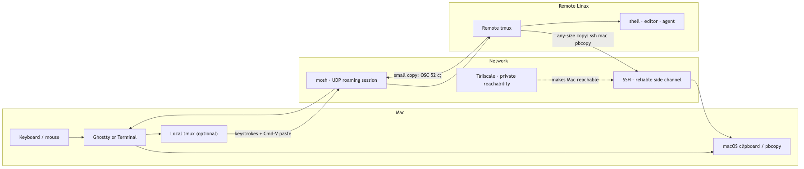
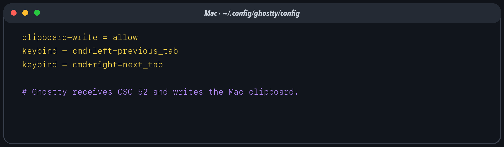
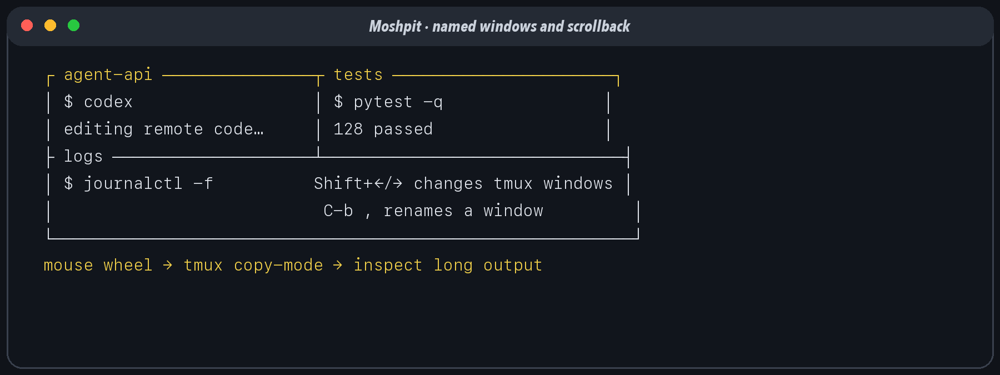
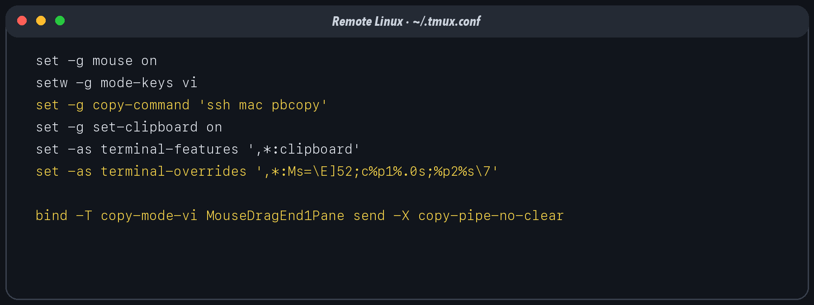

# Welcome to the mosh pit

Agent development is unusually hard on a fragile terminal session. An agent may be editing several files, running a test suite, watching logs, or waiting on a build when Wi-Fi changes, a laptop sleeps, or an SSH connection times out. The `alexy/moshpit` repository captures a compact answer: let Ghostty own the Mac-facing terminal, let tmux own persistent workspaces, let mosh carry the interactive session, and use two clipboard paths—OSC 52 for convenience and SSH over Tailscale for reliability.

This guide starts at first principles and ends with the exact daily gestures. It documents the repository's `mac.tmux.conf`, `linux.tmux.conf`, `linux.zprofile`, and `MOSHPIT.md`, plus the corresponding Mac profile and SSH arrangement. Substitute your own key names, account names, and tailnet hostnames. Never copy private keys into a repository.



The diagram has two return paths because the terminal is not a shared desktop. Ordinary paste travels from the Mac clipboard into the terminal as input. Remote copy must deliberately travel back: either as an OSC 52 terminal event through mosh, or as selection bytes sent over SSH to `pbcopy` on the Mac.

# 1. Terminal: the screen and keyboard boundary

A terminal emulator is a Mac application that turns key presses into bytes and terminal control sequences into pixels, color, cursor motion, mouse reporting, and clipboard operations. The shell is not the terminal. tmux is not the terminal. Ghostty, iTerm2, and Terminal.app are terminals.

The distinction matters because the final write to the macOS clipboard happens at this boundary. A remote program can ask the terminal to set the clipboard with OSC 52, but the local terminal decides whether to honor the request.

## Ghostty setup

Create or edit `~/.config/ghostty/config` on the Mac:

```ini
clipboard-write = allow
keybind = cmd+left=previous_tab
keybind = cmd+right=next_tab
```

The first line authorizes programmatic clipboard writes, including OSC 52 arriving through mosh. The next two make Command–Left and Command–Right move between Ghostty tabs. Ghostty's keybinding form is `trigger=action`; `cmd` is an alias for the Super modifier. Reload the configuration or restart Ghostty after changing it.



Use Command–V for normal Mac-to-terminal paste. Ghostty inserts clipboard text into the active pseudo-terminal; mosh then carries it to the remote shell. Bracketed paste, when supported by the shell or editor, marks the payload as a paste rather than a stream of individually typed keys.

## Terminal.app

Apple Terminal can perform the inward half: Command–V pastes, Control–Tab selects the next tab, and Control–Shift–Tab selects the previous tab. If Command–Left/Right is the desired tab gesture, assign those shortcuts to Terminal's Previous Tab and Next Tab menu commands in System Settings → Keyboard → Keyboard Shortcuts → App Shortcuts.

Terminal.app is not the recommended endpoint for this stack because it does not provide the same OSC 52 clipboard-write path used here. The Tailscale-backed `ssh mac pbcopy` route still works, because `pbcopy` writes the clipboard independently of the terminal.

## Scrollback and the mouse

There are two histories: terminal scrollback outside tmux, and tmux copy-mode history inside tmux. With `set -g mouse on`, the wheel over a tmux pane enters or navigates copy-mode, so long command output remains inspectable. Press `q` or Escape to leave copy-mode. If an application owns the alternate screen or mouse reporting, hold Shift when needed to ask the terminal to handle a selection directly.

# 2. tmux: a persistent workspace

tmux is a terminal multiplexer. Its server owns sessions; a session owns windows; a window owns one or more panes. The visible terminal is merely a client attached to that server. Closing Ghostty, losing the network, or suspending the laptop detaches the client but does not end the remote programs.

That ownership model is the heart of resilient agent work. Start the agent inside remote tmux, not in the transient mosh shell around it:

```sh
tmux new -As work
```

`new -A` attaches to `work` if it exists or creates it if it does not. Detach with `C-b d`; reattach later with the same command.

## Windows, names, and the top border

Both repository configurations bind Shift–Left and Shift–Right without a prefix:

```tmux
bind -n S-Left  previous-window
bind -n S-Right next-window
set -g pane-border-status top
set -g pane-border-format "#{pane_title}"
```

This produces a clean navigation ladder: Command–Left/Right changes terminal tabs; Shift–Left/Right changes tmux windows inside the active tab. Rename the current tmux window with `C-b ,`, type a name such as `agent-api`, and press Return. The normal tmux status line shows window names. The repository additionally places pane titles on the top pane border. Programs can set a pane title; from a shell, `printf '\033]2;%s\033\\' 'logs'` is a portable way to ask many terminals/tmux setups to display one.



## Mouse and vi copy-mode

The shared base is:

```tmux
set -g mouse on
setw -g mode-keys vi
```

Mouse mode enables pane selection, resizing, window selection, and scroll-wheel entry into copy-mode. Vi mode makes `v` begin a selection and `y` perform the configured copy action after `C-b [` enters copy-mode.

The repository keeps two useful behaviors. “Copy and jump” uses `copy-selection-and-cancel`: the bytes are copied, copy-mode ends, and the viewport returns to live output. “Copy and stay” uses `copy-pipe-no-clear`: the bytes are copied through `copy-command`, but the highlight and scroll position remain. The Mac configuration chooses stay:

```tmux
bind -T copy-mode-vi MouseDragEnd1Pane send -X copy-pipe-no-clear
bind -T copy-mode-vi DoubleClick1Pane  send -X select-word \; send -X copy-pipe-no-clear
bind -T copy-mode-vi TripleClick1Pane  send -X select-line \; send -X copy-pipe-no-clear
```

For jump-on-copy, replace the last action with `copy-selection-and-cancel`. The no-clear form is especially pleasant while studying long logs: copy several fragments without snapping to the prompt, then press `q`.

## Local and remote copy commands

On the Mac, tmux pipes copied bytes directly to the system clipboard:

```tmux
set -g copy-command 'pbcopy'
```

On Linux, the reliable route calls back to the Mac:

```tmux
set -g copy-command 'ssh mac pbcopy'
```

The alias `mac` is defined in remote `~/.ssh/config`. Tailscale makes it reachable; SSH makes delivery reliable; `pbcopy` performs the final macOS clipboard write.

# 3. SSH: identity, bootstrap, and a reliable side channel

SSH provides authenticated, encrypted, ordered byte streams. In this design it has two jobs. First, mosh uses SSH to authenticate and start `mosh-server`. Second, a separate SSH connection carries large remote selections back to the Mac.

## Mac key and agent setup

The Mac `~/.zprofile` persists the agent environment in `~/.ssh/agent`, revives the agent after a reboot, protects the environment file with mode 600, and loads the private key through Apple's Keychain integration:

```zsh
SSH_ENV="$HOME/.ssh/agent"

_ssh_agent_start() {
  ssh-agent -s > "$SSH_ENV"
  chmod 600 "$SSH_ENV"
  . "$SSH_ENV" > /dev/null
  ssh-add --apple-use-keychain "$HOME/.ssh/YOUR_MAC_KEY" 2>/dev/null
}

[ -f "$SSH_ENV" ] && . "$SSH_ENV" > /dev/null
ssh-add -l > /dev/null 2>&1
[ $? -eq 2 ] && _ssh_agent_start
```

`ssh-add -l` returning 2 means the recorded agent is no longer reachable. The profile then starts a replacement instead of spawning a new agent for every shell. In `~/.ssh/config`, use `AddKeysToAgent yes`, `UseKeychain yes`, and an explicit `IdentityFile` for Mac-originated connections.

## Debian key and agent setup

The repository's `linux.zprofile` prefers an agent forwarded from the Mac. Only when `SSH_AUTH_SOCK` is empty does it source `~/.ssh/agent.env`, test the saved agent, and create a new one if necessary. It then loads each server-side key only when `ssh-add -T KEY.pub` says the agent cannot already sign for that public key.

This order is intentional:

1. Use the forwarded Mac agent when one exists; the private key stays on the Mac.
2. Otherwise reuse the server's persisted agent.
3. Start a fresh server agent only when the old socket is stale.
4. Add only keys that are actually present and not already loaded.

The checked-in array demonstrates several keys. In published examples, use neutral placeholders:

```zsh
SSH_KEYS=("$HOME/.ssh/"{remote_a,remote_b})
```

Treat those names as local examples. A public guide should show placeholders, and a public repository must never contain the corresponding private key bytes.

## The Mac as an allowed SSH destination

Enable System Settings → General → Sharing → Remote Login. Restrict access to the intended user. Put each remote host's public key—not its private key—in the Mac user's `~/.ssh/authorized_keys` (sometimes casually called the “allowed hosts” list), one key per line. Set safe permissions:

```sh
chmod 700 ~/.ssh
chmod 600 ~/.ssh/authorized_keys
```

Optionally constrain a clipboard-only key in `authorized_keys` with a forced command that accepts input only for `pbcopy`; otherwise a key authorized for SSH can open a normal login. Tailscale ACLs should also limit remote hosts to TCP port 22 on the Mac.

## Remote alias for clipboard return

On each Linux host, install the repository's `linux.ssh.config` as (or merge it into) `~/.ssh/config`. The checked-in file names the Mac through Tailscale and uses the server-side `linux` identity; the portable form is:

```sshconfig
Host mac
    HostName your-mac.your-tailnet.ts.net
    User your-mac-user
    IdentityFile ~/.ssh/YOUR_REMOTE_TO_MAC_KEY
    ControlMaster auto
    ControlPath ~/.ssh/cm-%r@%h:%p
    ControlPersist 10m
    BatchMode yes
    ConnectTimeout 3
```

The first copy opens a TCP connection; later copies—many of them tiny clipboard payloads—reuse its control socket instead of repeating key exchange and authentication. `ControlPersist 10m` keeps that master alive between copies. `BatchMode yes` prevents a selection from hanging on a password prompt, and the short timeout fails quickly if the Mac is asleep.

It helps to name the two kinds of reuse accurately. `linux.zprofile` makes login shells converge on one usable **SSH agent**, so sessions can ask the same credential broker to sign. `linux.ssh.config` makes clipboard commands converge on one **multiplexed SSH transport**, so `ssh mac pbcopy` can send small packets over an already-authenticated connection. An agent holds or brokers identities; it is not itself the network connection.

# 4. mosh: the roaming interactive transport

Plain SSH binds the terminal to one TCP connection. If the client address changes, a NAT mapping expires, or the laptop sleeps long enough, that connection dies. mosh—the mobile shell—uses SSH only for bootstrap, then runs a state-synchronizing terminal protocol over UDP. The client predicts local echo and reconnects as addresses change. The remote tmux session survives either way, but mosh makes the attached experience far less brittle.

Install mosh 1.4.0 or newer on both ends. Verify with:

```sh
mosh --version
mosh-server --version
```

Connect by SSH alias:

```sh
mosh debian
tmux new -As work
```

If a firewall is strict, allow the configured mosh UDP port range. Tailscale can carry the reachability between tailnet nodes without opening a public inbound path.

## OSC 52 through mosh

OSC 52 is a terminal escape sequence shaped like `ESC ] 52 ; c ; BASE64 BEL`. tmux generates it, mosh recognizes and relays it, and Ghostty writes the decoded payload to the Mac clipboard.

The repository's load-bearing override forces the clipboard target to the literal `c` accepted by mosh:

```tmux
set -g set-clipboard on
set -as terminal-features ',*:clipboard'
set -as terminal-overrides ',*:Ms=\E]52;c%p1%.0s;%p2%s\7'
```

`c%p1%.0s` prints `c` and suppresses tmux's first parameter; `%p2%s` emits the base64 payload. The wildcard avoids guessing whether a client reports `xterm-256color`, `tmux-256color`, or another TERM name.

After changing terminal capabilities, detach and reattach. The reliable ritual during setup is:

```sh
tmux kill-server
```

This ends every session in that server, so save work first. A simple `source-file` does not retroactively bind all client capabilities.



## Why keep the SSH path

mosh clipboard events are best effort and small. Large or multi-line selections may exceed the practical event payload and disappear; a later failure can look like the clipboard is “stuck” on its previous value. `ssh mac pbcopy` uses reliable TCP and accepts any ordinary text size. Keep OSC 52 as the low-friction fallback, but make SSH the primary `copy-command` when correctness matters.

# 5. Tailscale: a return address for the laptop

The remote server cannot normally dial a laptop behind home NAT. Tailscale gives both machines private tailnet identities, stable 100.x addresses, and optional MagicDNS names. The Linux host can therefore resolve `mac` and reach SSH without exposing the Mac to the public internet.

On cloud Linux, Tailscale normally needs outbound connectivity. It attempts a direct UDP path and can fall back to a relay over HTTPS. A private subnet needs egress through a NAT gateway or equivalent. No new public inbound security-group rule is required for the Tailscale path.

Use an ephemeral or tagged auth key for unattended servers, keep ACLs narrow, and follow the organization's network policy. Do not print auth keys in shell history or documentation.

# 6. Copy and paste, both directions

## Mac to Linux

1. Copy text in any Mac application with Command–C.
2. Focus the Ghostty tab and tmux pane.
3. Press Command–V.
4. Ghostty writes the characters to its pseudo-terminal; local tmux, mosh, and remote tmux forward them to the focused shell, editor, or agent.

No OSC 52 is involved. For commands containing newlines or untrusted text, paste into an editor or use a shell's safe-paste behavior before execution. A terminal paste can execute text if it includes a final newline.

## Linux to Mac: copy and stay

1. Scroll with the mouse wheel to the desired remote output.
2. Drag a selection, double-click a word, or triple-click a line.
3. The `copy-pipe-no-clear` binding sends the bytes through `ssh mac pbcopy` while preserving the selection and viewport.
4. Paste anywhere on the Mac with Command–V.
5. Press `q` or Escape when finished reviewing scrollback.

## Linux to Mac: copy and jump

Bind `MouseDragEnd1Pane` to `copy-selection-and-cancel`. Releasing the mouse copies, exits copy-mode, and jumps to current output. This is faster for one-shot extraction but less pleasant for repeated fragments from old logs.

## Keyboard-only remote copy

1. Press `C-b [` to enter copy-mode.
2. Navigate with vi motions.
3. Press `v` to begin selection.
4. Move to the other end.
5. Press `y` or invoke the configured copy action.

If `y` does not use `copy-command` in the installed tmux version/configuration, add an explicit copy-mode-vi binding to `copy-pipe-and-cancel` or `copy-pipe-no-clear`.

# 7. Verification ladder

Test one boundary at a time.

## Terminal and mosh, outside tmux

In a plain mosh shell:

```sh
printf '\033]52;c;%s\a' "$(printf hello | base64)"
```

If `hello` reaches the Mac clipboard, mosh and Ghostty cooperate. If not, verify mosh 1.4+, Ghostty's `clipboard-write = allow`, and the active terminal.

## OSC 52 through tmux

Run the same command inside a freshly attached tmux client. A success proves tmux forwards OSC 52. Then test tmux's own copy-mode generation. If the manual sequence works but a selection does not, inspect the `Ms` override and reattach.

## Reliable SSH return

From Linux:

```sh
printf 'ssh clipboard test' | ssh mac pbcopy
```

If it fails, run `tailscale status`, resolve the MagicDNS name, test `ssh -v mac true`, inspect Mac Remote Login access, and verify `authorized_keys`. `tmux show-buffer` distinguishes a selection failure from a transport failure: if the buffer contains the text, the selection fired.

# 8. The daily agent-development loop

Open a Ghostty tab for each broad context; use Command–Left/Right between tabs. Within a context, attach to one named tmux session and use Shift–Left/Right between windows. Name windows after the work—`agent`, `tests`, `logs`, `review`—with `C-b ,`. Split panes only when simultaneous visibility is useful; windows remain easier to name and navigate.

Run the agent inside tmux. Put long builds and servers in separate windows. Scroll through output with the mouse. Copy one fragment and jump when returning immediately to the prompt; copy and stay when collecting evidence. Paste Mac context inward with Command–V. Copy remote evidence outward through Tailscale-backed SSH, with OSC 52 ready as a lightweight fallback.

The result is less a trick than a division of responsibility: Ghostty owns the local human interface, tmux owns durable process state, mosh owns the roaming interaction, SSH owns authenticated reliable transfer, and Tailscale owns private reachability. When each layer does one job, remote agent work survives the ordinary chaos of laptops and networks.

# Appendix A. Repository map

- `README.md` — concise purpose and prerequisites.
- `MOSHPIT.md` — the detailed OSC 52 discovery, gotchas, and troubleshooting ladder.
- `mac.tmux.conf` — local navigation, pane titles, mouse copy-mode, `pbcopy`, and copy-and-stay bindings.
- `linux.tmux.conf` — remote navigation, OSC 52, and `ssh mac pbcopy`.
- `linux.zprofile` — forwarded-agent preference and reusable Debian agent fallback.
- `linux.ssh.config` — GitHub and Mac aliases plus a persistent multiplexed return connection for small clipboard writes.
- `book/` — this reproducible First Pair Press edition, diagrams, figures, metadata, and build configuration.
- `blog/` — the announcement source and generated textpack.

# Appendix B. Sources and further reading

- The canonical project source: `https://github.com/alexy/moshpit`
- Ghostty configuration and keybindings: `https://ghostty.org/docs/config/keybind`
- Apple Terminal keyboard shortcuts: `https://support.apple.com/guide/terminal/keyboard-shortcuts-trmlshtcts/mac`
- tmux manual: `https://man.openbsd.org/tmux`
- mosh documentation: `https://mosh.org/`
- Tailscale documentation: `https://tailscale.com/kb/`
